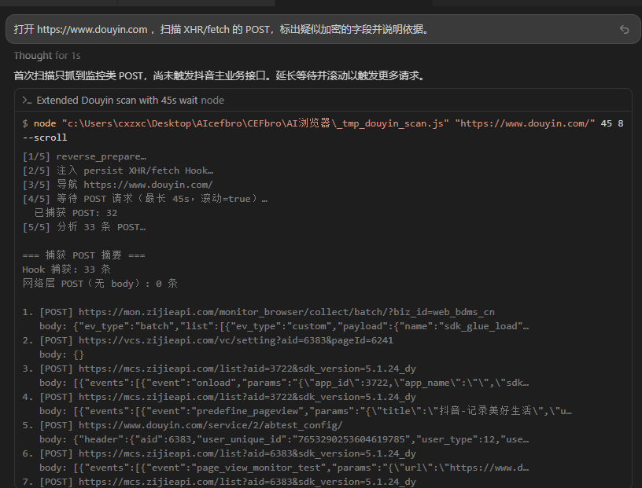

# AI Browser MCP Server — Open Source Announcement


> Copy for GitHub, forums, Twitter/X, Reddit, Dev.to.  

> Repository: https://github.com/AI-XiaoDao/ai-browser-mcp


---


## Short post (copy & paste)


```

[Open Source] AI Browser MCP Server v2.8.0 — Local browser automation for Windows


268 MCP tools for **any AI agent** (Cursor, Claude, Cline, custom MCP clients): navigate, fill forms, read DOM, network, workflows, CDP debugger.


✅ One sentence → auto-runs: scrape data, reverse POST crypto fields, locate sign JS via breakpoints


✅ Open: Volcano .wsv source + generated C++ reference + docs (MIT)

✅ Binary: GitHub Releases — **x64 ~157MB / win32 ~136MB**, exe + CEF — **all 268 tools, download and go**

✅ Local-only: 127.0.0.1:9222 by default


Download: https://github.com/AI-XiaoDao/ai-browser-mcp/releases/tag/v2.8.0

  · AI-Browser-MCP-x64-v2.8.0.zip / AI-Browser-MCP-win32-v2.8.0.zip — runtime

  · AI-Browser-MCP-cpp-x64-v2.8.0.zip / AI-Browser-MCP-cpp-win32-v2.8.0.zip — generated C++ (optional)


Star welcome: https://github.com/AI-XiaoDao/ai-browser-mcp

```


---


## Scenario cheat sheet (copy & paste)


```

AI Browser MCP · One-sentence scenarios v2.6


① Scrape   "Scroll list, collect title/price as JSON"     → dom_query / collect

② Reverse  "Scan POST, flag likely encrypted fields"      → inject Hook + network

③ Locate   "Break on submit, show sign function source"   → debugger_* (Release: included)

④ Fill     "Log in and export order table"                → fill_* / workflow

⑤ Reuse    "Save as workflow JSON, run next time"        → workflow_*


Setup: exe + Cursor mcp_bridge.js → 127.0.0.1:9222

Repo: github.com/AI-XiaoDao/ai-browser-mcp

```


---


## One-liner


**AI Browser MCP Server** is a **Windows-native local MCP service** built with Volcano IDE + FBrowser CEF. **Any MCP-compatible AI agent** — Cursor, Claude Desktop, Cline, OpenCode, or your own app — can drive a real browser with **217** `browser_*` tools via HTTP/WebSocket or `mcp_bridge.js`.


---


## Highlights (full)


See [README · Core advantages](README.md#-核心优点全景) for the complete table. Summary:


| Area | Why it matters |

|------|----------------|

| **268 MCP tools** | Navigate, fill forms, DOM, JS, network, workflows, CDP — 24 categories |

| **Natural language** | One sentence: scrape data, reverse crypto fields, locate sign functions — Agent chains tools |

| **Real FBrowser CEF** | Visible browser window, not headless-only simulation |

| **sync-wait + batch** | Fewer round-trips; easier agent orchestration |

| **Dual JSON-RPC** | WebSocket + HTTP POST; CORS on all HTTP endpoints |

| **Cursor bridge** | `mcp_bridge.js` + auto env vars (`AI_BROWSER_MCP_*`) |

| **Workflows** | JSON step chains in `workflows/` |

| **Local-first** | `127.0.0.1:9222` by default; tray keeps MCP alive |

| **MIT open source** | `.wsv` source + `generated-cpp/` + docs + `run_all_tests.js` |

| **Download = full power** | Release zip includes screenshot, CDP, debugger, fingerprint, intercept — all 268 tools |

| **Extensible** | Workflows, Hook scenarios, skills, MIT source — PRs welcome |


> Four GUI window tools are **disabled** in embedded GUI mode — the main window manages the browser instance.


### Typical prompts (copy into Cursor)


No scripts required — describe the goal:


| Scenario | Example prompt | Release zip |

|----------|----------------|:-----------:|

| **Data collection** | “Scroll this product list and collect title, price, and URL as JSON.” | ✅ |

| **Reverse algorithms** | “Scan XHR/fetch POST bodies and flag likely encrypted fields.” | ✅ |

| **Locate algorithm** | “Break on submit, step until you find the JS function that computes sign; show source.” | ✅ |

| **Auto fill / RPA** | “Log in with these credentials and export the first 20 order rows.” | ✅ |

| **Workflow reuse** | “Save this login→scrape flow as JSON and run it once to verify.” | ✅ |


The Agent picks `browser_navigate` → `browser_collect` / `browser_inject` / `browser_debugger_*` automatically. See [README · Scenarios (ZH)](README.md#-典型场景一句话自动执行).


### Before vs after


| Task | Traditional (Playwright, etc.) | AI Browser MCP |

|------|-------------------------------|----------------|

| Scrape a list | Write selectors + scroll loop + parser | One sentence in Cursor → Agent calls MCP |

| Find encrypted POST fields | Manual DevTools + Hook | “Scan POST for encrypted fields” → `inject` |

| Find sign function | Manual breakpoints + stack walk | “Break on submit, show sign source” → `debugger_*` |

| Daily report | Cron + script maintenance | `workflow_run` JSON |


### How one sentence becomes a tool chain


```

You describe the goal in Cursor

  → AI picks scenario (scrape / reverse / locate / fill)

  → MCP tools run with sync-wait after each step

  → On failure (success:false), AI retries or reports why

  → Structured result: JSON / table / source snippet

```


#### Walkthrough: scrape


**Prompt:** “Open example.com/products, scroll 2 screens, collect title and price as JSON.”


1. `browser_navigate` → wait for load  

2. `browser_evaluate` scroll or click “load more”  

3. `browser_dom_query` / `browser_collect`  

4. On empty selector → `success:false` → AI retries or explains  

5. Returns JSON (you can ask for CSV next)


#### Walkthrough: reverse


**Prompt:** “Open douyin.com, scan XHR/fetch POST and flag likely encrypted fields.”


1. `browser_reverse_prepare` — network detail + console  

2. `browser_inject` — persist Hook on XHR/fetch  

3. Trigger requests → compare field shapes (hex blobs, etc.)  

4. Output suspected fields + rationale  

5. Optional: `douyin_xhr_encrypt_scan.js` for reference



#### Walkthrough: locate (CDP debugger)


**Prompt:** “Break on login submit, follow to the JS function that computes sign; show source.”


1. `browser_debugger_enable`  

2. `debugger_set_breakpoint` on submit / XHR  

3. Trigger submit → `debugger_stack` + `debugger_script_source`  

4. `debugger_step` until sign function → return name + snippet


### vs Playwright / cloud browser APIs


| | AI Browser MCP | DIY Playwright | Cloud browser API |

|--|:--:|:--:|:--:|

| AI via MCP | ✅ native | build your own | varies |

| Setup | download exe | env + scripts | signup + billing |

| Offline | ✅ | ✅ | ❌ |

| Pre-built tools | **217** | roll your own | vendor-dependent |

| One-sentence run | ✅ scrape / reverse / locate | ❌ write scripts | ❌ write API calls |

| Source | ✅ MIT | varies | closed |


---


## FAQ


**Q: Do I really not need to write scripts?**  

A: After exe + Cursor bridge setup, describe the goal in natural language. The Agent picks MCP tools step by step. Fixed flows can be saved as `workflows/*.json`.


**Q: Why is scrape result empty?**  

A: Often: login required, lazy-load not scrolled, wrong selector. Ask AI to scroll N screens first or probe with `browser_dom_query`.


**Q: Reverse vs locate?**  

A: **Reverse** = which request/field looks encrypted (Hook + network). **Locate** = which JS function computes it (CDP debugger + stack).

**Q: Can MCP network tools see POST bodies?**  

A: **No by default.** Use persist Hook (`browser_inject`). See `skills/场景与Hook测试.md`.


---


## Quick start


1. Download [AI-Browser-MCP-x64-v2.8.0.zip](https://github.com/AI-XiaoDao/ai-browser-mcp/releases/download/v2.8.0/AI-Browser-MCP-x64-v2.8.0.zip) (~157MB)

2. Extract and run **AI浏览器.exe**

3. Open http://127.0.0.1:9222/health → `"status":"ok"`

4. Configure Cursor:


```json

{

  "mcpServers": {

    "ai-browser": {

      "command": "node",

      "args": ["path/to/mcp_bridge.js"],

      "env": {

        "AI_BROWSER_MCP_HTTP_POST": "http://127.0.0.1:9222/mcp"

      }

    }

  }

}

```


5. Self-check: `node mcp_bridge.js --check`

6. Try: “Scroll this product list and collect title and price as JSON.”


**Requirements**: Windows 10/11 x64 · Node.js 18+ (for Cursor bridge) · CEF runtime included in zip


---


## Twitter / X (copy & paste)


```

[Open Source] AI Browser MCP v2.8 — 268 tools for Cursor on Windows


One sentence → auto-runs:

· Scrape data from pages

· Reverse POST crypto fields

· Locate sign JS via CDP breakpoints


Local FBrowser CEF · MIT · 127.0.0.1:9222


https://github.com/AI-XiaoDao/ai-browser-mcp/releases/tag/v2.8.0

```


---


## Reddit (copy & paste)


```

Title: [Release] AI Browser MCP Server v2.8 — local Windows browser automation for any MCP AI agent (268 tools)


Windows-native MCP server wrapping FBrowser CEF with 268 browser_* tools.


Plain-language prompts in Cursor:

- "Scroll this list and collect title/price as JSON"

- "Scan POST bodies and flag encrypted-looking fields"

- "Break on submit and show the sign JS function"


127.0.0.1:9222 · MIT · .wsv source on GitHub


https://github.com/AI-XiaoDao/ai-browser-mcp/releases/tag/v2.8.0

```


---


## What's in the repo?


| Included | Path |

|----------|------|

| **Authoritative source** | `CEFbro/AI浏览器/src/*.wsv` (11 files) |

| **Generated C++ reference** | `CEFbro/AI浏览器/generated-cpp/release-x64/` |

| Docs & 217-tool reference | `docs/`, `skills/AI浏览器MCP.md` |

| Bridge & tests | `mcp_bridge.js`, `run_all_tests.js` |

| License | MIT |


| Not in Git | Get from |

|------------|----------|

| exe + CEF binaries | GitHub Releases |

| FBrowser CEF libs | Volcano IDE install |

| `linker/out/` (.obj/.pch) | **Not source** — never ship in releases |


**Develop against `.wsv`, not generated C++.**


---


## Links


- **Repo**: https://github.com/AI-XiaoDao/ai-browser-mcp

- **Release v2.8.0**: https://github.com/AI-XiaoDao/ai-browser-mcp/releases/tag/v2.8.0

- **Chinese announcement**: [OPEN_SOURCE.md](OPEN_SOURCE.md)

- **Contributing**: [CONTRIBUTING.md](CONTRIBUTING.md)


---


## Long-form (blog / Dev.to)


**AI Browser MCP Server** bridges the gap between AI assistants and a real Windows browser. Instead of asking Cursor to write Playwright scripts from scratch, you run a local exe that exposes **217** ready-made MCP tools.


**One sentence is enough**: describe scrape / reverse / locate goals — the Agent chains `browser_navigate`, `browser_collect`, `browser_inject`, `browser_debugger_*`, etc., with sync-wait between steps.


The repo ships Volcano `.wsv` source (authoritative), generated C++ for audit, docs, and `mcp_bridge.js` for Cursor. Binaries are on GitHub Releases (~157MB, CEF included). Default bind: `127.0.0.1:9222`.


Download: https://github.com/AI-XiaoDao/ai-browser-mcp/releases/tag/v2.8.0


