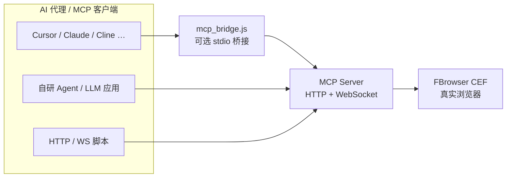
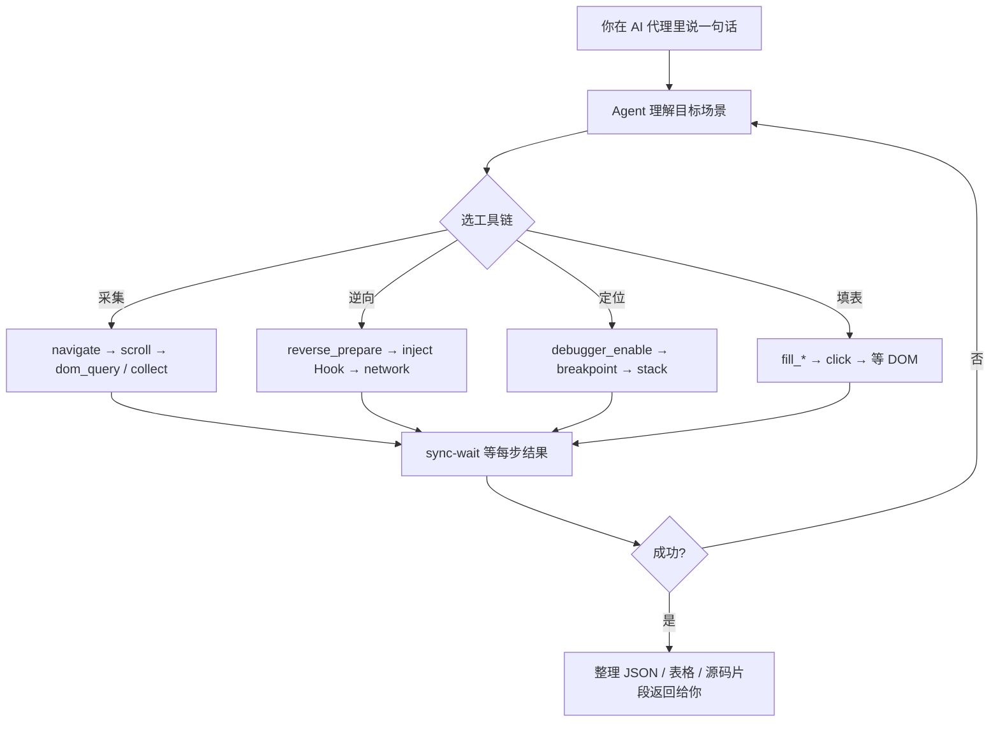
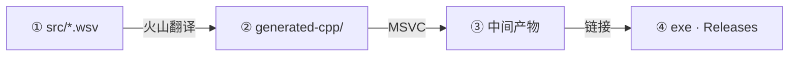

<div align="center">

# AI Browser MCP Server

### 任意 AI 代理 · 一句话操控 Windows 真实浏览器

**标准 MCP 协议** · **217 工具全开放** · **FBrowser CEF 真实浏览器** · **本机 `127.0.0.1:9222`** · **MIT 开源**

*Any MCP agent — Cursor, Claude Desktop, Cline, OpenCode, or your own LLM app · Download and go*

[](https://github.com/AI-XiaoDao/ai-browser-mcp/releases/tag/v2.6.0)
[](LICENSE)
[](https://github.com/AI-XiaoDao/ai-browser-mcp/releases)
[](https://github.com/AI-XiaoDao/ai-browser-mcp/actions/workflows/validate.yml)
[](CEFbro/AI浏览器/skills/AI浏览器MCP.md)
[]()
[]()

[⚡ 3 步上手](#-3-步上手) · [强大扩展](#-强大扩展能力) · [一句话场景](#-典型场景一句话自动执行) · [下载](#-下载与运行成品) · [核心优点](#-核心优点全景) · [文档](#-文档) · [论坛发帖](FORUM_POSTS.md) · [开源公告](OPEN_SOURCE.md) · [English](OPEN_SOURCE_EN.md)

</div>

---

## ✨ 这是什么？

在 Windows 上运行 **AI浏览器.exe**，本机暴露 **Model Context Protocol (MCP)** 服务。**不限于 Cursor** — 任何支持 MCP 的 AI 代理（Claude Desktop、Cline、OpenCode、自研 Agent 等）或 **HTTP/WebSocket 脚本** 均可调用 **217 个** `browser_*` 工具。说一句话，Agent 自动串联执行，无需手写 Playwright。

| 接入方式 | 适用 |
|----------|------|
| **stdio MCP** | Cursor、Claude Desktop、Cline 等 — 用 [`mcp_bridge.js`](CEFbro/AI浏览器/mcp_bridge.js) 桥接 |
| **HTTP POST** | 任意语言 / 自研 Agent — `POST http://127.0.0.1:9222/mcp` |
| **WebSocket** | 长连接 JSON-RPC — `ws://127.0.0.1:9222` |

| 一句话场景 | 示例 |
|------------|------|
| **采集数据** | 「滚动商品列表，采标题价格 JSON」 |
| **逆向算法** | 「扫描 POST，标出疑似加密字段」（Hook 抓 body） |
| **定位算法** | 「断点跟到 sign 函数，给源码片段」（CDP 调试器） |
| **自动填表** | 「登录后台，导出订单表」 |
| **固化复用** | 「存成 workflow JSON，下次一键跑」 |

---

## ⚡ 3 步上手

1. **下载** [`AI-Browser-MCP-x64-v2.6.0.zip`](https://github.com/AI-XiaoDao/ai-browser-mcp/releases/download/v2.6.0/AI-Browser-MCP-x64-v2.6.0.zip)（~157MB）→ 解压 → 双击 **`AI浏览器.exe`**
2. **确认** 浏览器打开 [`http://127.0.0.1:9222/health`](http://127.0.0.1:9222/health) → `"status":"ok"`
3. **接入 AI 代理** — Cursor / Claude / 任意 MCP 客户端（见下方配置）→ 对 Agent 说：**「滚动列表，把标题价格采成 JSON」**

<details>
<summary><b>Cursor / Claude Desktop 配置（stdio MCP，点击展开）</b></summary>

```json
{
  "mcpServers": {
    "ai-browser": {
      "command": "node",
      "args": ["CEFbro/AI浏览器/mcp_bridge.js"],
      "env": {
        "AI_BROWSER_MCP_HTTP_POST": "http://127.0.0.1:9222/mcp"
      }
    }
  }
}
```

Release 解压目录请将 `args` 改为本机 `mcp_bridge.js` 路径。自检：`node mcp_bridge.js --check`

**其他 Agent**：任何实现 MCP 的客户端，只要指向 `http://127.0.0.1:9222/mcp`（HTTP）或配置 `mcp_bridge.js`（stdio）即可；亦可用 Node / Python 直接 `POST` JSON-RPC。

</details>

→ 完整步骤见下方 [🚀 快速开始（详细）](#-快速开始详细)

> **🎁 GitHub Release 下载即用**：[`AI-Browser-MCP-x64-*.zip`](https://github.com/AI-XiaoDao/ai-browser-mcp/releases) 已包含 **全部 217 个工具**（截图、CDP 调试器、指纹、网络拦截、工作流等），解压运行即可，**无需额外配置**。



---

## 🔌 强大扩展能力

不只是一个浏览器远程控制端 — 自带 **Agent 编排层** 与 **可二次开发** 生态：

| 扩展 | 能做什么 |
|------|----------|
| **217 MCP 工具** | 导航 / 填表 / DOM / JS / 网络 / 截图 / CDP / 调试器 / 指纹 … 24 大类，[完整参考](CEFbro/AI浏览器/skills/AI浏览器MCP.md) |
| **sync-wait + batch** | 同次调用等结果；一次请求串联多工具，省 Token、少轮次 |
| **工作流 JSON** | `workflows/*.json` 多步骤编排，`workflow_run` 一键复跑，可版本管理 |
| **事件 Hook** | 生命周期 / 网络 / 资源 / 弹窗 … 可扩展 Hook，支持 persist 注入 |
| **场景脚本** | [`scenarios/`](CEFbro/AI浏览器/scenarios/) 逆向扫描、Hook 测试、断点恢复等现成范例 — [实测截图](.github/demo-douyin-post-scan.png) |
| **技能书 + 测试** | [`skills/`](CEFbro/AI浏览器/skills/) Agent 知识库；[`run_all_tests.js`](CEFbro/AI浏览器/run_all_tests.js) 全量回归 |
| **HTTP / WebSocket / stdio** | 任意 AI 代理或自研程序接入；[`mcp_bridge.js`](CEFbro/AI浏览器/mcp_bridge.js) 桥接 IDE |
| **欢迎页 + 在线文档** | `9222` 健康检查、工具搜索、复制 MCP 配置、浏览 [`docs/`](CEFbro/AI浏览器/docs/) |
| **MIT 源码** | 11 个 `.wsv` 模块（~2 万行）欢迎 PR — 改 [`src/`](CEFbro/AI浏览器/src/) 即可扩展新工具 |

<details>
<summary><b>二次开发 / 自行编译（点击展开）</b></summary>

- **改 MCP 逻辑**：编辑 `CEFbro/AI浏览器/src/*.wsv`，详见 [CONTRIBUTING.md](CONTRIBUTING.md)
- **火山编译**：打开 `AI浏览器.vprj` → Release x64；C++ 对照见 [`generated-cpp/`](CEFbro/AI浏览器/generated-cpp/)

</details>

---

## 🌟 核心优点（全景）

### 对 AI 用户 — 为什么选它？

| 优点 | 说明 |
|------|------|
| **自然语言驱动** | 在任意 MCP AI 代理里说需求，Agent 自动选工具，无需从零写 Playwright/Puppeteer 脚本 |
| **217 个开箱工具** | 导航、填表、读 DOM、执行 JS、网络观察、工作流、CDP 断点等，覆盖常见自动化场景 |
| **真实浏览器窗口** | 基于 **FBrowser CEF** 内核，非纯无头模拟，页面行为更接近用户日常浏览 |
| **sync-wait 智能同步** | 常用读操作默认在同一次调用内等待结果，Agent 编排更简单、少轮询 |
| **工作流 JSON** | 多步骤任务写成 JSON，一键 `workflow_run`，可版本管理、可分享 |
| **batch 批量调用** | 一次请求串联多工具，减少往返、降低 Token 消耗 |
| **欢迎页控制台** | `http://127.0.0.1:9222/` 查健康状态、浏览文档、复制 MCP 客户端配置 |
| **一句话自动执行** | 说需求即可：Agent 自选工具链（导航→Hook→读网络→断点→导出），全程 MCP 驱动 |

### 典型场景 · 一句话自动执行 {#一句话能干啥}

不用写脚本、不用记 217 个工具名。在 **任意 AI 代理**（Cursor、Claude、自研 MCP 客户端等）里用自然语言描述目标，Agent 会按场景自动组合 `browser_*` / `workflow_*` / 调试器，并在每步 **sync-wait** 等结果后再决定下一步。

#### 场景速查

| # | 场景 | 一句话示例 | 主要工具 |
|:-:|------|------------|----------|
| ① | **数据采集** | 「滚动列表，采标题价格 JSON」 | `dom_query` / `collect` / `evaluate` |
| ② | **逆向分析** | 「扫描 POST，标出疑似加密字段」 | `reverse_prepare` / `inject` / `network` |
| ③ | **定位算法** | 「断点跟到 sign 函数，给源码」 | `debugger_*` |
| ④ | **自动填表** | 「登录后台，导出订单表」 | `fill_*` / `workflow_run` |
| ⑤ | **工作流复用** | 「存成 JSON，下次一键跑」 | `workflow_*` |

#### 以前 vs 现在

| 任务 | 传统做法（Playwright 等） | AI浏览器 MCP |
|------|---------------------------|--------------|
| 采商品列表 | 写选择器 + 滚动循环 + 解析 + 存文件 | 对 Agent：**「滚动采标题价格 JSON」** → 自动调 MCP |
| 找 POST 加密字段 | 开 DevTools → 手动 Hook → 对比字段 | **「扫描 POST 标加密字段」** → `inject` + 网络对比 |
| 找 sign 函数 | 搜源码 → 手动下断点 → 跟栈 | **「提交时下断点，给 sign 源码」** → `debugger_*` 编排 |
| 固定日报 | 维护 cron + 脚本版本 | **workflow JSON** + 一句 `workflow_run` |

#### ① 数据采集 — 「帮我把这个页面的数据采下来」

| 你说 | AI 通常会做 |
|------|-------------|
| 「打开某电商列表页，滚动加载，把商品名、价格、销量采成 JSON」 | `browser_navigate` → `browser_evaluate` 滚动 → `browser_dom_query` / `browser_collect` → 整理输出 |
| 「登录后进入订单页，把表格每一行导出」 | 填表登录 → 等 DOM → 循环读单元格 → 结构化返回 |
| 「盯着这个接口，把返回 JSON 里的 list 字段提出来」 | `browser_network` / `browser_collect` → 过滤 URL → 解析响应 |

**相关工具**：`browser_dom_query`、`browser_collect`、`browser_network`、`browser_evaluate`、`workflow_run`（多页可写成工作流 JSON 复用）。

#### ② 逆向算法 — 「帮我找出 POST 里哪个字段是加密的」

| 你说 | AI 通常会做 |
|------|-------------|
| 「打开抖音，扫描 XHR/fetch 的 POST，标出疑似加密字段」 | `browser_reverse_prepare` → `browser_inject` 持久 Hook → 触发请求 → 对比字段启发式 |
| 「抓这个表单提交时的请求体和响应」 | 开网络详情 → 填表提交 → `browser_network` / 资源拦截读 body |
| 「Hook console，把页面里打印的 sign 参数记下来」 | `browser_console_enable` → 操作页面 → `browser_console_get` |

**要点**：MCP 网络层**默认不记 POST body**，须 **persist Hook**（`browser_inject`）或资源拦截。可参考 [`douyin_xhr_encrypt_scan.js`](CEFbro/AI浏览器/scenarios/douyin_xhr_encrypt_scan.js) 与 [`场景与Hook测试.md`](CEFbro/AI浏览器/skills/场景与Hook测试.md)。

#### ③ 定位算法 — 「帮我定位签名算法在哪个 JS 函数里」

| 你说 | AI 通常会做 |
|------|-------------|
| 「在提交按钮处下断点，单步跟到算 sign 的函数」 | `browser_debugger_enable` → 设 DOM/XHR 断点 → `debugger_step` / `debugger_stack` |
| 「列出所有脚本，搜索包含 md5 / sign 的函数并断在那里」 | CDP 脚本枚举 → `debugger_set_breakpoint` → 触发请求 → 读栈与局部变量 |
| 「把命中断点时的 call stack 和源码片段给我」 | `debugger_stack` + `debugger_script_source` → 标注函数名与行号 |

**相关工具**：`browser_debugger_*` 断点/单步/栈/源码/flow 编排（Release 成品已开放）；配合 `browser_evaluate` 可在页面内探测 `window` 上的加密对象。

#### ④ 自动填表 / 简单 RPA — 「帮我把这个表单填完并提交」

| 你说 | AI 通常会做 |
|------|-------------|
| 「打开后台，用户名 admin、密码 xxx，点登录」 | `browser_navigate` → `browser_fill_*` → `browser_fill_click` → 等跳转 |
| 「把 Excel 里这 10 行逐条录入这个页面」 | 读你提供的表格 → 循环填表 → 语义失败时报告哪一行出错 |
| 「每天固定：打开某页 → 点导出 → 等下载完成」 | 可固化成 `workflows/*.json`，以后一句 `workflow_run` |

**相关工具**：`browser_fill_click`、`browser_fill_set_value`、`browser_fill_select`、`workflow_run`。

#### ⑤ 固化复用 — 「把这个流程存成工作流，下次一键跑」

多步骤任务（登录 → 翻页采集 → 导出）可写成 JSON 放进 `workflows/`，Agent 或脚本调用 `workflow_list` / `workflow_get` / `workflow_run` 重复执行，适合**定时采集**、**回归测试**、**演示复现**。

#### Agent 怎么「一句话」跑起来？



#### Walkthrough：采集一句话的完整路径

**你说：**
```
打开 https://example.com/products ，滚动加载 2 屏，把每个商品的标题和价格采成 JSON 数组。
```

**Agent 内部大致会：**

1. `browser_navigate` → sync-wait 等页面加载  
2. `browser_evaluate` 执行 `window.scrollBy` 或点击「加载更多」  
3. `browser_dom_query` 或 `browser_collect` 读列表节点  
4. 若某选择器为空 → 收到 `success:false`，自动换选择器或报告原因  
5. 将结果整理为 JSON 文本回复（你可再说「导出 CSV」继续）

**逆向 / 定位**同理：你说目标，Agent 在 Hook、网络、断点、栈之间循环，直到给出「疑似加密字段列表」或「sign 函数源码片段」。

#### Walkthrough：逆向一句话的完整路径

**你说：**
```
打开 https://www.douyin.com ，扫描 XHR/fetch 的 POST，标出疑似加密的字段并说明依据。
```

**Agent 内部大致会：**

1. `browser_reverse_prepare` — 开网络详情 + console，返回逆向指引  
2. `browser_inject` — 注入 persist Hook 拦截 `XMLHttpRequest.send` / `fetch`  
3. `browser_navigate` 或等你手动触发页面操作  
4. `browser_network` / 读 Hook 回调 — 对比 POST 字段名与值形态（长 hex、无规律 base64 等）  
5. 输出「疑似字段列表 + 依据」；必要时建议跑 `douyin_xhr_encrypt_scan.js` 对照

**实测效果**（Cursor + Agent 一句话触发，自动注入 Hook、滚动触发请求、分析 33 条 POST）：


#### Walkthrough：定位一句话的完整路径

**你说：**
```
在这个登录页点提交时下断点，跟到计算 sign 的 JS 函数，把函数名和源码片段给我。
```

**Agent 内部大致会：**

1. `browser_debugger_enable` — 开启 CDP 调试器  
2. `browser_navigate` 到目标页  
3. `debugger_set_breakpoint` — 在提交事件或 XHR 发送处断住  
4. 你或 AI 触发提交 → `debugger_stack` + `debugger_script_source`  
5. `debugger_step` 单步直到进入 sign 计算函数 → 返回函数名、行号、源码片段

若断点不命中：让 AI 改挂 `fetch` 发送断点，或先用 `browser_evaluate` 搜 `window` 上的 sign 相关对象。

#### 话术示例（复制到 AI 代理对话即可）

```
帮我把 https://example.com/products 前 3 页的商品标题和价格采集成 JSON 数组。

打开 https://www.douyin.com ，找出 POST 请求里疑似加密的字段，并说明依据。

在这个登录页提交时下断点，定位计算 password/sign 的 JS 函数，把函数名和源码片段给我。

用账号 test / 密码 123456 登录后台，进入「订单列表」，把前 20 行导出成表格。

把「打开某站 → 登录 → 翻 3 页采集 → 汇总 JSON」写成 workflow JSON，保存到 workflows/ 并跑一遍验证。
```

### 协议与集成 — 接得进、用得广

| 优点 | 说明 |
|------|------|
| **标准 MCP** | 实现 Model Context Protocol — **Cursor / Claude / Cline / OpenCode / 自研 Agent** 等任意 MCP 客户端 |
| **双通道 JSON-RPC** | **WebSocket** 长连接 + **HTTP POST** `/mcp`，脚本与 IDE 均可接入 |
| **stdio 桥接（可选）** | `mcp_bridge.js`：stdio ↔ HTTP，供 IDE 类客户端；仓库自带 `.mcp.json` 示例 |
| **全端点 CORS** | HTTP 接口均带 CORS，前端页面可直接 `fetch` 调 MCP |
| **CDP 原生暴露** | `ws://127.0.0.1:9222/devtools/browser/{id}`，可接 Chrome DevTools 生态 |
| **环境变量自注册** | 启动后自动设置 `AI_BROWSER_MCP_URL` / `PORT` / `HEALTH`，客户端自动发现 |
| **在线文档服务** | 编译后 `linker/docs/` 可通过 `9222` 直接阅读，无需翻仓库 |

### 浏览器能力 — 217 工具分域

| 域 | 能力概要 |
|----|----------|
| 导航与页面 | 打开/后退/刷新、多框架、标题/URL |
| DOM / 填表 | 查询/点击/设值、FBrowser 官方填表 API |
| JS 执行 | `evaluate`、控制台脚本 |
| 网络 | 请求列表、`collect` 采集 |
| 鼠标键盘 / 编辑 | 基本输入与编辑操作 |
| Cookie / 缓存 / 代理 | 会话与环境控制 |
| 工作流 | `workflow_list/get/run/stop` |
| 截图 / PDF / 下载 | 页面留存与文件 |
| 网络拦截 / CDP | 改包、协议级控制 |
| 指纹 / 内核开关 | 防检测、UA/Canvas/WebGL 等 |
| 调试器 | 断点、单步、栈、脚本源码、flow 编排 |
| DevTools / 窗口 | 开发者工具、窗口与系统级控制 |

> 完整工具表见 [`AI浏览器MCP.md`](CEFbro/AI浏览器/skills/AI浏览器MCP.md)（217 工具 · 24 类）。

### 工程与体验 — 为 Agent 设计

| 优点 | 说明 |
|------|------|
| **语义失败检测** | 元素未找到、`{ok:false}` 等返回 `success:false`，避免 AI 误判成功 |
| **async 任务 ID** | `task_<毫秒>_<盐>_<计数>`，可追踪长任务，`mcp_result` 取回结果 |
| **事件 Hook 系统** | 浏览器生命周期、网络、回调等可扩展 Hook |
| **双通道资源拦截** | 内核 API + 事件 Hook 协同，支持网络观察与改包 |
| **可配置超时/日志** | `mcp_config.json` 调节速率、网络日志、响应缓存等 |
| **全量测试脚本** | `run_all_tests.js` 顺序验证 MCP 工具，便于回归 |
| **托盘常驻** | 关闭主窗口后 MCP 常仍在托盘运行，适合长时间 Agent 任务 |

### 安全与本地优先

| 优点 | 说明 |
|------|------|
| **默认本机绑定** | 服务监听 `127.0.0.1:9222`，不暴露公网，适合本地 Agent |
| **数据不出本机** | 浏览器与 MCP 同机运行，页面数据由你掌控 |
| **MIT 开源可审计** | `.wsv` 权威源码 + `generated-cpp/` 对照，协议与行为透明 |

### 开源与生态 — 能学、能改、能发

| 优点 | 说明 |
|------|------|
| **完整源码公开** | 11 个 `.wsv` MCP 模块（~2 万行）+ 文档 + 技能书 + 测试 |
| **四层产物清晰** | `src` → `generated-cpp` → 运行包，结构清晰可审计 |
| **一键发版脚本** | `release/pack-release.ps1` 打包 Release，自动排除 `out/` |
| **国内技术栈** | 火山视窗 + FBrowser CEF，中文文档与 QQ/火山社群支持 |
| **GitHub 配套齐全** | Issue/PR 模板、Discussions、CI 校验、CHANGELOG |

### 为什么选择 AI浏览器 MCP

| 维度 | 亮点 |
|------|------|
| **AI 接入** | 标准 MCP — Cursor / Claude / 自研 Agent 均可 |
| **上手** | 下载 Release → 运行 exe → 接入代理，分钟级 |
| **工具深度** | **217 预封装** 工具，含 CDP / Hook / 工作流 / 调试器 |
| **一句话执行** | 采集 / 分析 / 定位 / 填表 — Agent 自动串联 |
| **隐私** | 本机 `127.0.0.1`，数据不出机器 |
| **开源** | MIT · 完整 `.wsv` 源码 · 欢迎扩展 PR |

---

## 🚀 快速开始（详细）

### 方式 A：使用成品（推荐新手）

1. 从 [Releases](https://github.com/AI-XiaoDao/ai-browser-mcp/releases) 下载 **`AI-Browser-MCP-x64-v2.6.0.zip`**（约 157MB，已排除编译中间产物）
2. 解压，双击 **`AI浏览器.exe`**
3. 浏览器打开 `http://127.0.0.1:9222/health`，确认 `"status":"ok"`
4. 接入 AI 代理（仓库根目录 [`.mcp.json`](.mcp.json) 可复制；亦可用 HTTP 直连 `9222/mcp`）：

```json
{
  "mcpServers": {
    "ai-browser": {
      "command": "node",
      "args": ["CEFbro/AI浏览器/mcp_bridge.js"],
      "env": {
        "AI_BROWSER_MCP_HTTP_POST": "http://127.0.0.1:9222/mcp"
      }
    }
  }
}
```

5. 自检：`node CEFbro/AI浏览器/mcp_bridge.js --check`
6. 对 AI 说一句话即可，例如见 [典型场景 · 话术示例](#-典型场景一句话自动执行)

### 方式 B：从火山源码编译

**依赖**：Windows x64、[火山视窗 IDE](https://www.voldp.com/)（含 FBrowser CEF 模块）、Node.js（桥接脚本）

1. 打开 `CEFbro/AI浏览器/AI浏览器.vprj`，编译 **Release x64**
2. 运行时分发目录：`_int/AI浏览器/release/x64/linker/`（含 exe、dll、docs、workflows）
3. 打包 Release 时排除编译缓存（见 [`pack-release.ps1`](release/pack-release.ps1)）

---

## 📦 下载与运行成品

| 内容 | 路径 | 说明 |
|------|------|------|
| 运行时脚本与文档 | [`release/linker/`](release/linker/) | `mcp_bridge.js`、配置、工作流、在线文档（**无 exe**） |
| 完整安装包 | [GitHub Releases](https://github.com/AI-XiaoDao/ai-browser-mcp/releases) | `AI-Browser-MCP-x64-v2.6.0.zip`：**217 工具全开放**，exe + CEF + 文档/脚本 |
| 生成 C++ 源码 | [`generated-cpp/release-x64/`](CEFbro/AI浏览器/generated-cpp/release-x64/) | 火山翻译的 `.cpp`/`.h`（v2.6.0，亦见 Release 附件） |
| 火山工程源码 | [`CEFbro/AI浏览器/src/`](CEFbro/AI浏览器/src/) | `.wsv` MCP 服务核心（**本仓开源主体**） |

运行包从 [Releases](https://github.com/AI-XiaoDao/ai-browser-mcp/releases) 下载；源码在本仓库 `src/` 与 `generated-cpp/`。

---

<details>
<summary><b>📂 开发者：源码结构与编译说明（点击展开）</b></summary>

## 开源范围与火山编译目录

本仓库 MIT 公开 **MCP 服务 `.wsv` 源码**、**生成 C++ 对照**、文档/脚本/场景；运行包 exe 见 [Releases](https://github.com/AI-XiaoDao/ai-browser-mcp/releases)。

### 四层对照

| 层级 | 是什么 | 二次开发改这里？ | Git 仓库 | Release 附件 |
|:--:|--------|:--:|----------|--------------|
| **① 权威源码** | 火山 `.wsv` | ✅ | `src/*.wsv` | — |
| **② 生成 C++** | 编译对照 | 只读 | `generated-cpp/` | cpp zip |
| **③ 中间产物** | `.obj`/`.pch` | — | 不入仓 | — |
| **④ 运行成品** | exe + CEF | — | Releases | x64 zip |

> 改 **`src/*.wsv`** 提 PR；C++ 见 **`generated-cpp/`**（= 编译时 `project/`）。

### 编译流水线



维护者发版：[`release/pack-release.ps1`](release/pack-release.ps1)。详见 [`generated-cpp/README.md`](CEFbro/AI浏览器/generated-cpp/README.md) · [`CONTRIBUTING.md`](CONTRIBUTING.md)。

</details>

---

## 🧰 能力速查

| 类别 | 示例工具 |
|------|----------|
| 导航 | `browser_navigate` / `back` / `reload` |
| DOM / 填表 | `browser_fill_click` / `browser_dom_query` |
| JS | `browser_evaluate` / `execute_js` |
| 网络 | `browser_network` / `browser_collect` |
| 工作流 | `workflow_run` 多步骤 JSON |
| 截图 / CDP / 调试 | `browser_screenshot` / `browser_debugger_enable` 等 |

完整 217 工具分 24 类，见 [`skills/AI浏览器MCP.md`](CEFbro/AI浏览器/skills/AI浏览器MCP.md)。**全部优点**见上方 [核心优点（全景）](#-核心优点全景)。

---

## 📁 仓库结构

```
ai-browser-mcp/
├── CEFbro/AI浏览器/
│   ├── src/              # 火山 .wsv 源码（MCP 核心，开源主体）
│   ├── generated-cpp/    # 火山生成的 C++ 对照（release-x64/）
│   ├── docs/             # 客户手册、配置说明
│   ├── skills/           # Agent 技能书 + 217 工具参考 + 火山 API 知识库
│   ├── mcp_bridge.js     # Cursor stdio 桥接
│   ├── run_all_tests.js  # MCP 全量测试
│   ├── workflows/        # 工作流 JSON 源码（编译复制到 linker/workflows/）
│   └── AI浏览器.vprj     # 火山工程文件
├── release/
│   ├── linker/           # 成品配置包（文档/脚本/工作流，无 exe）
│   └── pack-release.ps1  # Release 一键打包脚本
├── CONTRIBUTING.md       # 贡献与发版指南
├── CHANGELOG.md          # 版本更新日志
├── CODE_OF_CONDUCT.md    # 社区行为准则
├── SECURITY.md           # 安全报告策略
├── OPEN_SOURCE.md        # 开源公告（中文，多平台可复制）
├── OPEN_SOURCE_EN.md     # Open-source announcement (English)
├── LICENSE               # MIT
└── README.md
```

---

## 📖 文档

| 文档 | 读者 |
|------|------|
| [客户使用手册](CEFbro/AI浏览器/docs/客户使用手册.md) | 终端用户 |
| [MCP 工具配置说明书](CEFbro/AI浏览器/docs/MCP工具配置说明书.md) | 部署 / 集成 |
| [使用技能书](CEFbro/AI浏览器/docs/使用技能书.md) | 开发者 / Agent |
| [217 工具参考](CEFbro/AI浏览器/skills/AI浏览器MCP.md) | 全量 API |
| [场景与 Hook 测试](CEFbro/AI浏览器/skills/场景与Hook测试.md) | 逆向 / persist Hook / 断点恢复 |
| [典型场景（README）](#-典型场景一句话自动执行) | 采集 / 逆向 / 定位话术 |

---

## 🏗 架构

| 模块 | 文件 | 职责 |
|------|------|------|
| 入口 | `main.wsv` | GUI + FBrowser 初始化 |
| MCP 核心 | `MCP_Server.wsv` | JSON-RPC、工具注册、sync-wait |
| 分派 | `MCP_Server_Core/Form/VIP/System/Workflow.wsv` | 217 工具实现 |
| HTTP/WS | `MCP_Server_HTTP.wsv` | 欢迎页、健康检查、文档 |
| 桥接 | `mcp_bridge.js` | stdio MCP 客户端 ↔ HTTP POST（Cursor 等 IDE 可选） |

---

## 🤝 参与与反馈

- **Issue**： [Bug 模板](https://github.com/AI-XiaoDao/ai-browser-mcp/issues/new?template=bug_report.yml) · [功能建议](https://github.com/AI-XiaoDao/ai-browser-mcp/issues/new?template=feature_request.yml)
- **Discussions**：[问答 / 案例分享](https://github.com/AI-XiaoDao/ai-browser-mcp/discussions)（见 [.github/SOCIAL_PREVIEW.md](.github/SOCIAL_PREVIEW.md) 置顶帖文案）
- **PR**：见 [CONTRIBUTING.md](CONTRIBUTING.md)
- **宣传材料**：中文 [OPEN_SOURCE.md](OPEN_SOURCE.md) · 英文 [OPEN_SOURCE_EN.md](OPEN_SOURCE_EN.md)
- **交流**：QQ 212577526 · 群 737680767 · [火山编程交流群](https://qm.qq.com/q/Hpv6qm8qUE)

## ❓ 常见问题

| 问题 | 处理 |
|------|------|
| `/health` 失败 | 确认 exe 已启动；检查 9222 端口占用 |
| AI 代理连不上 MCP | `node mcp_bridge.js --check`；确认 `AI_BROWSER_MCP_HTTP_POST` 或直连 `9222/mcp` |
| 工具调用超时 | 增大 `mcp_config.json` 中 `default_timeout_ms` |
| POST body 抓不到 | 默认网络层不记录 POST 正文，见 `skills/场景与Hook测试.md` |
| 一句话采集没数据 | 检查是否需登录/滚动加载；让 AI 用 `browser_dom_query` 先试选择器 |
| 逆向扫不到加密字段 | 使用 `browser_inject` persist Hook；参考 `douyin_xhr_encrypt_scan.js` |
| 调试器断点不命中 | 确认已 `browser_debugger_enable` 且页面已触发提交 |
| 成品 zip 较大 | 含 CEF 运行时，属正常体积 |

更多 FAQ 见 [OPEN_SOURCE.md#常见问题](OPEN_SOURCE.md#常见问题faq)。

## 📄 许可证

[MIT License](LICENSE)

---

<div align="center">

**如果这个项目对你有帮助，欢迎 Star ⭐**

</div>
