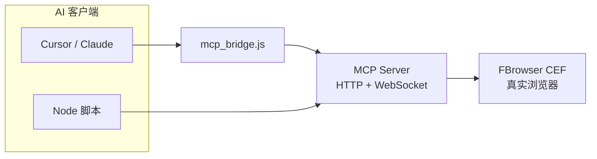

<div align="center">

# AI Browser MCP Server

**AI浏览器 MCP — 让 Cursor / Claude 用自然语言操控真实浏览器**

[](LICENSE)
[](CEFbro/AI浏览器/skills/AI浏览器MCP.md)
[]()
[]()

[快速开始](#-快速开始) · [下载成品](#-下载与运行成品) · [文档](#-文档) · [架构](#-架构) · [开源说明](OPEN_SOURCE.md)

</div>

---

## ✨ 这是什么？

**AI浏览器 MCP Server** 是一款运行在 Windows 上的本地浏览器自动化服务。启动后在本机 `9222` 端口暴露 **Model Context Protocol (MCP)** 接口，为 AI 助手提供 **217 个** `browser_*` 工具——导航、填表、读 DOM、抓网络、工作流、CDP 断点等，开箱即用。

> 你只需在 Cursor 里说：「打开 example.com 并读取标题」—— AI 会自动调用 MCP 工具完成。



---

## 🚀 快速开始

### 方式 A：使用成品（推荐新手）

1. 从 [Releases](../../releases) 下载 `AI浏览器-x64.zip`（或本地 `release/` 目录编译后产物）
2. 解压，双击 **`AI浏览器.exe`**
3. 浏览器打开 `http://127.0.0.1:9222/health`，确认 `"status":"ok"`
4. 配置 Cursor（仓库根目录 `.mcp.json` 可复制）：

```json
{
  "mcpServers": {
    "ai-browser": {
      "command": "node",
      "args": ["CEFbro/AI浏览器/mcp_bridge.js"],
      "env": {
        "AI_BROWSER_MCP_HTTP_POST": "http://127.0.0.1:9222/mcp"
      }
    }
  }
}
```

5. 自检：`node CEFbro/AI浏览器/mcp_bridge.js --check`

### 方式 B：从火山源码编译

1. 安装 [火山视窗 IDE](https://www.voldp.com/) 与 FBrowser CEF 模块
2. 打开 `CEFbro/AI浏览器/AI浏览器.vprj`，编译 **Release x64**
3. 产物在 `_int/AI浏览器/release/x64/linker/`，可复制到 `release/linker/` 分发

---

## 📦 下载与运行成品

| 内容 | 路径 | 说明 |
|------|------|------|
| 运行时脚本与文档 | [`release/linker/`](release/linker/) | `mcp_bridge.js`、配置、工作流、在线文档 |
| 完整安装包 | [GitHub Releases](../../releases) | 含 `AI浏览器.exe` 与 CEF 运行时（发布时上传） |
| 火山工程源码 | [`CEFbro/AI浏览器/src/`](CEFbro/AI浏览器/src/) | `.wsv` MCP 服务核心 |

`release/linker/` 为**可分发配置包**；可执行文件需自行编译或从 Releases 下载。

---

## 🧰 能力一览

| 类别 | 示例工具 | VIP |
|------|----------|-----|
| 导航 | `browser_navigate` / `back` / `reload` | 否 |
| DOM / 填表 | `browser_fill_click` / `dom_query` | 否 |
| JS | `browser_evaluate` / `execute_js` | 否 |
| 网络 | `browser_network` / `browser_collect` | 否 |
| 工作流 | `workflow_run` 多步骤 JSON | 否 |
| 截图 / CDP / 指纹 | `browser_screenshot` / `browser_cdp` | 是 |

完整列表见 [`skills/AI浏览器MCP.md`](CEFbro/AI浏览器/skills/AI浏览器MCP.md)。

---

## 📁 仓库结构

```
ai-browser-mcp/
├── CEFbro/AI浏览器/
│   ├── src/              # 火山 .wsv 源码（MCP 核心）
│   ├── docs/             # 客户手册、配置说明
│   ├── skills/           # Agent 技能书 + 217 工具参考
│   ├── mcp_bridge.js     # Cursor stdio 桥接
│   └── workflows/        # 工作流 JSON 示例
├── release/linker/       # 成品配置包（文档/脚本/工作流）
├── OPEN_SOURCE.md        # 开源发布公告（可转发）
└── README.md
```

---

## 📖 文档

| 文档 | 读者 |
|------|------|
| [客户使用手册](CEFbro/AI浏览器/docs/客户使用手册.md) | 终端用户 |
| [MCP 工具配置说明书](CEFbro/AI浏览器/docs/MCP工具配置说明书.md) | 部署 / 集成 |
| [使用技能书](CEFbro/AI浏览器/docs/使用技能书.md) | 开发者 / Agent |
| [217 工具参考](CEFbro/AI浏览器/skills/AI浏览器MCP.md) | 全量 API |

---

## 🏗 架构

| 模块 | 文件 | 职责 |
|------|------|------|
| 入口 | `main.wsv` | GUI + FBrowser 初始化 |
| MCP 核心 | `MCP_Server.wsv` | JSON-RPC、工具注册、sync-wait |
| 分派 | `MCP_Server_Core/Form/VIP/System/Workflow.wsv` | 217 工具实现 |
| HTTP/WS | `MCP_Server_HTTP.wsv` | 欢迎页、健康检查、文档 |
| 桥接 | `mcp_bridge.js` | Cursor stdio ↔ HTTP POST |

---

## 🤝 参与与反馈

- **Issue**：Bug、功能建议
- **PR**：欢迎改进文档与脚本；核心 `.wsv` 请附测试说明
- **交流**：QQ 212577526 · 群 737680767 · [火山编程交流群](https://qm.qq.com/q/Hpv6qm8qUE)

## 📄 许可证

[MIT License](LICENSE)

---

<div align="center">

**如果这个项目对你有帮助，欢迎 Star ⭐**

</div>
