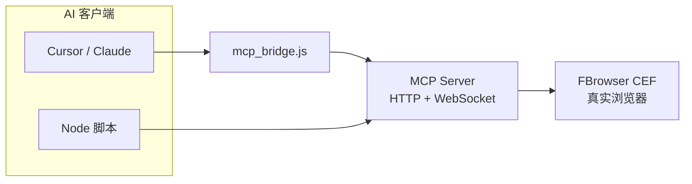
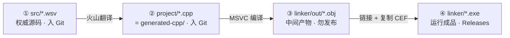

<div align="center">

# AI Browser MCP Server

**AI浏览器 MCP — 让 Cursor / Claude 用自然语言操控真实浏览器**

[](LICENSE)
[](https://github.com/AI-XiaoDao/ai-browser-mcp/releases)
[](https://github.com/AI-XiaoDao/ai-browser-mcp/actions/workflows/validate.yml)
[](https://github.com/AI-XiaoDao/ai-browser-mcp/issues)
[](https://github.com/AI-XiaoDao/ai-browser-mcp/discussions)
[](CEFbro/AI浏览器/skills/AI浏览器MCP.md)
[]()
[]()

[快速开始](#-快速开始) · [下载成品](#-下载与运行成品) · [文档](#-文档) · [架构](#-架构) · [开源说明](OPEN_SOURCE.md) · [English](OPEN_SOURCE_EN.md)

</div>

---

## ✨ 这是什么？

**AI浏览器 MCP Server** 是一款运行在 Windows 上的本地浏览器自动化服务。启动后在本机 `9222` 端口暴露 **Model Context Protocol (MCP)** 接口，为 AI 助手提供 **217 个** `browser_*` 工具——导航、填表、读 DOM、抓网络、工作流、CDP 断点等，开箱即用。

> 你只需在 Cursor 里说：「打开 example.com 并读取标题」—— AI 会自动调用 MCP 工具完成。



---

## 🚀 快速开始

### 方式 A：使用成品（推荐新手）

1. 从 [Releases](https://github.com/AI-XiaoDao/ai-browser-mcp/releases) 下载 **`AI-Browser-MCP-x64-v2.6.0.zip`**（约 157MB，已排除编译中间产物）
2. 解压，双击 **`AI浏览器.exe`**
3. 浏览器打开 `http://127.0.0.1:9222/health`，确认 `"status":"ok"`
4. 配置 Cursor（仓库根目录 `.mcp.json` 可复制）：

```json
{
  "mcpServers": {
    "ai-browser": {
      "command": "node",
      "args": ["CEFbro/AI浏览器/mcp_bridge.js"],
      "env": {
        "AI_BROWSER_MCP_HTTP_POST": "http://127.0.0.1:9222/mcp"
      }
    }
  }
}
```

5. 自检：`node CEFbro/AI浏览器/mcp_bridge.js --check`

### 方式 B：从火山源码编译

**依赖**：Windows x64、[火山视窗 IDE](https://www.voldp.com/)（含 FBrowser CEF 模块）、Node.js（桥接脚本）

1. 打开 `CEFbro/AI浏览器/AI浏览器.vprj`，编译 **Release x64**
2. 运行时分发目录：`_int/AI浏览器/release/x64/linker/`（含 exe、dll、docs、workflows）
3. 打包 Release 时**排除** `linker/out/`（见下方「编译目录说明」）

---

## 📦 下载与运行成品

| 内容 | 路径 | 说明 |
|------|------|------|
| 运行时脚本与文档 | [`release/linker/`](release/linker/) | `mcp_bridge.js`、配置、工作流、在线文档（**无 exe**） |
| 完整安装包 | [GitHub Releases](https://github.com/AI-XiaoDao/ai-browser-mcp/releases) | `AI-Browser-MCP-x64-v2.6.0.zip`：exe + CEF 运行时 |
| 生成 C++ 源码 | [`generated-cpp/release-x64/`](CEFbro/AI浏览器/generated-cpp/release-x64/) | 火山翻译的 `.cpp`/`.h`（v2.6.0，亦见 Release 附件） |
| 火山工程源码 | [`CEFbro/AI浏览器/src/`](CEFbro/AI浏览器/src/) | `.wsv` MCP 服务核心（**本仓开源主体**） |

`release/linker/` 为**可分发配置包**；可执行文件从 Releases 下载或自行编译。

---

## 📂 开源范围与火山编译目录

本仓库公开 **`.wsv` 权威源码**、**自动生成的 C++ 对照**及文档/脚本；**不含** FBrowser 闭源库、exe/dll，以及 `linker/out/` 中间产物。

### 四层对照（先看这张表）

| 层级 | 是什么 | 二次开发改这里？ | Git 仓库 | 本地编译 `_int/.../release/x64/` | Release 附件 |
|:--:|--------|:--:|----------|----------------------------------|--------------|
| **① 权威源码** | 人工编写的火山 `.wsv` | ✅ **是** | `src/*.wsv` | —（源码在 `src/`，不在 `_int`） | — |
| **② 生成 C++** | 火山翻译的 `.cpp`/`.h` | ❌ 勿改 | `generated-cpp/release-x64/` | `project/` | `AI-Browser-MCP-cpp-*.zip` |
| **③ 中间产物** | MSVC 输出的 `.obj`/`.pch` | ❌ | ❌ 不入仓 | `linker/out/` | ❌ **禁止打包** |
| **④ 运行成品** | exe + CEF + 脚本/文档 | — | ❌ 大二进制 | `linker/`（除 `out/`） | `AI-Browser-MCP-x64-*.zip` |

> **一句话**：改 **`src/*.wsv`**；看 C++ 去 **`generated-cpp/`**（= 编译时的 `project/`）；**`out/` 不是源码**；给用户用的是 **`linker/` 里除 `out/` 外的文件**。

### 编译流水线



```
src/*.wsv  ──翻译──►  project/ ≡ generated-cpp/  ──编译──►  linker/out/  ──链接──►  linker/AI浏览器.exe
  ① 改这里              ② 只读对照                    ③ 勿打包              ④ 给用户
```

### 仓库内有什么 / 没有什么

| 路径 | 入 Git | 说明 |
|------|:--:|------|
| `CEFbro/AI浏览器/src/*.wsv` | ✅ | **① 开源核心** — 11 个 MCP 模块 |
| `CEFbro/AI浏览器/generated-cpp/release-x64/` | ✅ | **② C++ 对照** — 33 cpp + 218 h，与 `project/` 同步 |
| `docs/`、`skills/`、`mcp_*.js`、`workflows/` | ✅ | 文档、217 工具参考、桥接与测试 |
| `release/linker/` | ✅ | 配置包镜像（无 exe/dll） |
| `_int/` 整树 | ❌ | 本地编译输出（`.gitignore`）；其中 **`project/` 内容已同步到 `generated-cpp/`** |
| **`linker/out/`** | ❌ | **③ 中间产物**，约 400MB，**不是 C++ 源码** |
| `*.exe`、`libcef.dll` 等 | ❌ | **④** → [Releases](https://github.com/AI-XiaoDao/ai-browser-mcp/releases) |
| FBrowser CEF 模块 | — | 随 [火山 IDE](https://www.voldp.com/) 安装，不在本仓 |

### `_int` 目录树（Release x64，本地编译后）

编译 `AI浏览器.vprj` → **Release x64** 后生成：

```
CEFbro/AI浏览器/_int/AI浏览器/release/x64/
├── project/     → ② 与 Git 中 generated-cpp/release-x64/ 同内容
├── linker/      → ④ 运行成品根目录
│   ├── AI浏览器.exe、*.dll、docs/、workflows/、mcp_*.js
│   └── out/       → ③ .obj / .pch / make_params.txt（勿提交、勿打进 zip）
├── compiler/    → 临时目录（通常为空）
└── debuger/     → 调试辅助（通常为空）
```

### 常见误区

| 误解 | 实际 |
|------|------|
| `out/` 里是 C++ 源码 | ❌ 只有 **`.obj`/`.pch`**，是 ③ 中间产物 |
| C++ 源码在 `out/` | ✅ 在 **`project/`**（Git：`generated-cpp/`） |
| Release zip 里有 `linker/` 子文件夹 | ❌ 解压后 **与 exe 同目录** 即为成品布局 |
| 应改 `generated-cpp/` 提 PR | ❌ 请改 **`src/*.wsv`**，Release 后再同步 C++ |

维护者发版：[`release/pack-release.ps1`](release/pack-release.ps1)（自动排除 `out/`）。详见 [`generated-cpp/README.md`](CEFbro/AI浏览器/generated-cpp/README.md)。

---

## 🧰 能力一览

| 类别 | 示例工具 | VIP |
|------|----------|-----|
| 导航 | `browser_navigate` / `back` / `reload` | 否 |
| DOM / 填表 | `browser_fill_click` / `browser_dom_query` | 否 |
| JS | `browser_evaluate` / `execute_js` | 否 |
| 网络 | `browser_network` / `browser_collect` | 否 |
| 工作流 | `workflow_run` 多步骤 JSON | 否 |
| 截图 / CDP / 指纹 | `browser_screenshot` / `browser_debugger_enable` 等 | 是 |

完整列表见 [`skills/AI浏览器MCP.md`](CEFbro/AI浏览器/skills/AI浏览器MCP.md)。

---

## 📁 仓库结构

```
ai-browser-mcp/
├── CEFbro/AI浏览器/
│   ├── src/              # 火山 .wsv 源码（MCP 核心，开源主体）
│   ├── generated-cpp/    # 火山生成的 C++ 对照（release-x64/）
│   ├── docs/             # 客户手册、配置说明
│   ├── skills/           # Agent 技能书 + 217 工具参考 + 火山 API 知识库
│   ├── mcp_bridge.js     # Cursor stdio 桥接
│   ├── run_all_tests.js  # MCP 全量测试
│   ├── workflows/        # 工作流 JSON 源码（编译复制到 linker/workflows/）
│   └── AI浏览器.vprj     # 火山工程文件
├── release/
│   ├── linker/           # 成品配置包（文档/脚本/工作流，无 exe）
│   └── pack-release.ps1  # Release 一键打包脚本
├── CONTRIBUTING.md       # 贡献与发版指南
├── CHANGELOG.md          # 版本更新日志
├── CODE_OF_CONDUCT.md    # 社区行为准则
├── SECURITY.md           # 安全报告策略
├── OPEN_SOURCE.md        # 开源公告（中文，多平台可复制）
├── OPEN_SOURCE_EN.md     # Open-source announcement (English)
├── LICENSE               # MIT
└── README.md
```

---

## 📖 文档

| 文档 | 读者 |
|------|------|
| [客户使用手册](CEFbro/AI浏览器/docs/客户使用手册.md) | 终端用户 |
| [MCP 工具配置说明书](CEFbro/AI浏览器/docs/MCP工具配置说明书.md) | 部署 / 集成 |
| [使用技能书](CEFbro/AI浏览器/docs/使用技能书.md) | 开发者 / Agent |
| [217 工具参考](CEFbro/AI浏览器/skills/AI浏览器MCP.md) | 全量 API |

---

## 🏗 架构

| 模块 | 文件 | 职责 |
|------|------|------|
| 入口 | `main.wsv` | GUI + FBrowser 初始化 |
| MCP 核心 | `MCP_Server.wsv` | JSON-RPC、工具注册、sync-wait |
| 分派 | `MCP_Server_Core/Form/VIP/System/Workflow.wsv` | 217 工具实现 |
| HTTP/WS | `MCP_Server_HTTP.wsv` | 欢迎页、健康检查、文档 |
| 桥接 | `mcp_bridge.js` | Cursor stdio ↔ HTTP POST |

---

## 🤝 参与与反馈

- **Issue**： [Bug 模板](https://github.com/AI-XiaoDao/ai-browser-mcp/issues/new?template=bug_report.yml) · [功能建议](https://github.com/AI-XiaoDao/ai-browser-mcp/issues/new?template=feature_request.yml)
- **Discussions**：[问答 / 案例分享](https://github.com/AI-XiaoDao/ai-browser-mcp/discussions)（见 [.github/SOCIAL_PREVIEW.md](.github/SOCIAL_PREVIEW.md) 置顶帖文案）
- **PR**：见 [CONTRIBUTING.md](CONTRIBUTING.md)
- **宣传材料**：中文 [OPEN_SOURCE.md](OPEN_SOURCE.md) · 英文 [OPEN_SOURCE_EN.md](OPEN_SOURCE_EN.md)
- **交流**：QQ 212577526 · 群 737680767 · [火山编程交流群](https://qm.qq.com/q/Hpv6qm8qUE)

## ❓ 常见问题

| 问题 | 处理 |
|------|------|
| `/health` 失败 | 确认 exe 已启动；检查 9222 端口占用 |
| Cursor 连不上 MCP | `node mcp_bridge.js --check`；确认 `AI_BROWSER_MCP_HTTP_POST` |
| 工具调用超时 | 增大 `mcp_config.json` 中 `default_timeout_ms` |
| POST body 抓不到 | 默认网络层不记录 POST 正文，见 `skills/场景与Hook测试.md` |
| 成品 zip 很大 | 正常；勿把 `linker/out/` 打进包（见 `release/pack-release.ps1`） |

更多 FAQ 见 [OPEN_SOURCE.md#常见问题](OPEN_SOURCE.md#常见问题faq)。

## 📄 许可证

[MIT License](LICENSE)

---

<div align="center">

**如果这个项目对你有帮助，欢迎 Star ⭐**

</div>
